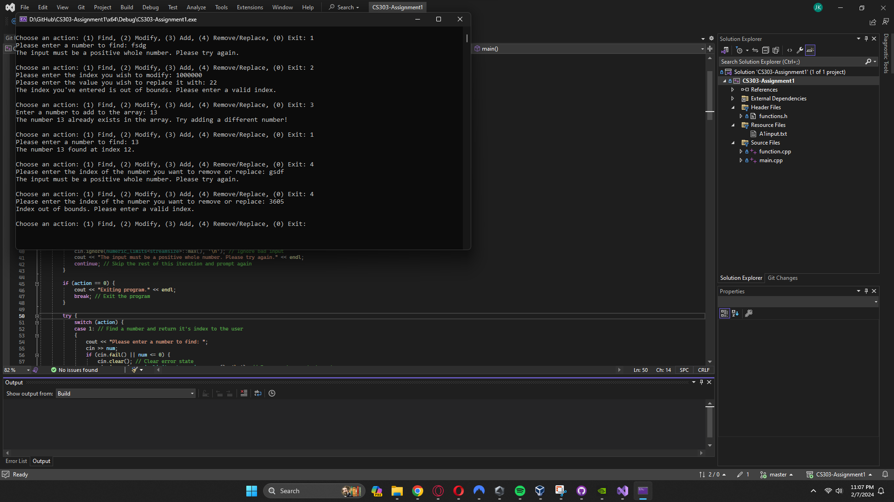

# CS303-Assignment1
Jeffery Kimbrow

#### References:
[C++ Input Validation](https://www.delftstack.com/howto/cpp/cpp-input-validation/#google_vignette)

[C++ Input Validation](https://www.delftstack.com/howto/cpp/clear-input-buffer-in-cpp/)

[C++ Input Validation](https://www.delftstack.com/howto/cpp/cpp-cin-fail/)

[C++ memcpy for array resizing](https://stackoverflow.com/questions/15685240/how-to-copy-arrray-to-array-using-memcpy-in-c)

#### To Do:
- Refactor input validation into a seperate function to call to. 
- Fix validation for decimals, not currently working (round down issue?) 

## Overview

This program is used to manage integers in a 1D array, allowing the user find, modify, add, and remove or replace integers based upon on the user's input. 

## Setup

1. Open Visual Studio Community. (Tested in Visual Studio Community 2022 only)
2. Select File -> Open -> Project/Solution and navigate to teh downloaded project files. 
3. Choose the solution file (.sln) file or main.cpp to open the project.
4. Right click the Project in the Solution Explorer and click Set as Startup Project. 
5. Press Crtl + F5 to build and run the program without debugging, or F5 to run with debugging. 

### Valid User Input

### Invalid User Input

